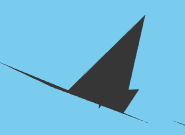

# Flocking-Simulation
Flocking simulation of starling murmuration using web graphics library(webGL) and openGL shader language in javascript.

#### Flocking behavior
Flocking is a the motion of birds together and flocking behavior is a type of behavior exhibited when a group of birds, called a flock, are in flight.

#### Starling mumuration
Starlings are small to medium-sized passerine birds in the family Sturnidae. It is known as murmuration, when a huge flocks of starling in migration form shape-shifting flight patterns. A good example is shown below - 

## About the program

We have used **GLSL(OpenGL Shading Language)** for bird's position, bird's velocity, bird's geometry and the vertices of bird's geomtery. A shading language is a graphics programming language adapted to programming shader effects. There is a hardware-based parallelization when computing in GPU, which makes the GPU particularly fit to process & render graphics.

**An Example For Fragment-Shader To Develop an Understanding in Shaders**

```html
<script id="BoidPositionFragmentShader" type="x-shader/x-fragment"></script>
```
- `type="x-shader/x-fragment"` has no actual use and isn't an official terminology. It is an informal way as shown in many tutorials to use this to inform the code reader that it is a fragment shader program. Browser ignores such tag, which are undefined. We will avoid it to reduce confusion, and instead use comments to increase **readability**.

```javascript
uniform float clock;
uniform float del_change;
void main()	{
	vec2 textcoordi = gl_FragCoord.xy / resolution.xy;
	vec4 temp_position = texture2D( PositionTexture, textcoordi );
	vec3 position = temp_position.xyz;
	vec3 velocity = texture2D( VeloctiyTexture, textcoordi ).xyz;

	float wcoordinate = temp_position.w;

	wcoordinate = mod( ( wcoordinate + del_change*2.0 +
		length(velocity.xz) * del_change * 3. +
		max(velocity.y, 0.0) * del_change * 6. ), 50.0 );

	gl_FragColor = vec4( position + velocity * del_change * 15. , wcoordinate );}
```
- `gl_FragCoord`, `resolution` and `texture2D` are predefined global variables for fragment coordinates, resolution of window (opened) and the texture lookup function (to get color information about texture), [for more](https://webplatform.github.io/docs/tutorials/webgl_textures/).
- `uniform` is a qualifier of shader, which can be used in both vertex and fragment shaders. Its **read-only for shaders**. There are other two qualifiers, namely `attribute` and `varying`, [for more](https://stackoverflow.com/questions/17537879/in-webgl-what-are-the-differences-between-an-attribute-a-uniform-and-a-varying).
- `vec2`, `vec3`, `vec4` are types in shader for respectively two, three and four coordinate vectors.

## Structures

### Boid Geometry
- The boid implemented here is a **combination of 3 triangles**, one acting as a _body_ (whose one angle is very small, i.e., making it look like actual body, additional features at end), and the other 2 acting as _wings_, which we will be using while flapping.



- **vertex_append** function takes a list of argument and then appends it in the `BufferAttribute` of `Float32Array`.

```javascript
function vertex_append() {
	for (var i = 0; i < arguments.length; i++) {
		vertices.array[v++] = arguments[i];
	}
}
```
- Here is how we define the boid's body. The calls of `vertex_append` function are in order as body, left wing and right wing.

```javascript
for (var i = 0; i < birds; i++ ) {
	vertex_append(
		0, -0, -6,
		0, 1, -15,
		0, 0, 8); //body call
	vertex_append(
		0, 0, -4,
		-6, 0, 0,
		0, 0, 4); //left wing call
	vertex_append(
		0, 0, 4,
		6, 0, 0,
		0, 0, -4); //right wing call
}
```
- Here is a part of `THREE.BirdGeometry` for initiating the function call, and showing its usage for some more variables and attributes.

```javascript
THREE.BirdGeometry = function () {

THREE.BufferGeometry.call(this);

var vertices = new THREE.BufferAttribute( new Float32Array( points * 3 ), 3 );

this.addAttribute( 'position', vertices );
```
- `THREE.BufferAttribute` stores data for an attribute associated with a BufferGeometry, [for more](https://threejs.org/docs/#api/core/BufferAttribute).

## Folder-Terminology

- **js-libs**: The static javascript library files from three.js and some from webGL-js.
- **js-func**: The functions in javascript used in the program.
- **shader**: Shader programs are the ones that are compiled in graphical processing unit.
- **css**: Used CSS stylesheets in the markup code.
- **img**: Images that shall be used in the front-end code.

## Running Locally

- Just run the `index.html` file, having the embedded javascript files in it.

- Run on local server
	- install npm
	- install http-server (or similar package)
	- run the http-server from the folder where the script is located
	- Go the local server claimed by http-server

- For linux users the terminal commands are as follows-
	```console
	sudo apt-get install -y nodejs
	sudo apt-get install npm
	sudo npm install http-server -g
	http-server -c-1

	```
## Points of Improvement

- The 3D sky can be made much better with clouds (as a shader program). It is looking dull with a single color, I found this [repo](https://github.com/mattatz/THREE.Cloud) of clouds, give it a view.

- Bird's shapes are very basic, it can be made more realistic if [Blender](https://www.blender.org/) is used to export 3D bird-object to JSON, which then can be used as a material in `Three.BirdGeometry`.

- Actual predator can be introduced, for simulation of falcon attack in a starling murmuration. I tried making it with **mouse pointer**, but due to the 3D camera textures, it is unintuitive to guess the proper algorithm, although mine works when birds are close to moving mouse but I am uncertain about its usage.


## Thanks to
- Thanks for the [three.js](https://github.com/mrdoob/three.js/) Javascript 3D library and the examples.

- This [project](https://github.com/OwenMcNaughton/Boids.js) by OwenMcNaughton for camera, scene, and 3D-viewpoint support.


## Informational Documents

- [Mathematical model of flocking behavior](http://www.diva-portal.org/smash/get/diva2:561907/FULLTEXT03.pdf)
- [Boids-algorithm - Pseudocode](http://www.kfish.org/boids/pseudocode.html)
- [Research Paper - Craig Reynold's simulation](http://www.csc.kth.se/utbildning/kandidatexjobb/datateknik/2011/rapport/erneholm_carl-oscar_K11044.pdf)


## A Useful Container
- Overleaf LaTex editor - mathematical modeling, click [here](https://www.overleaf.com/15649991qxqnpwqzxvjr)
- A [video](https://www.youtube.com/watch?v=b8eZJnbDHIg) of falcon attack on flock of starling.

## Contributing
Found a bug or have a suggestion? Feel free to create an issue or make a pull request!

## Know the Developer
- Ask him out for a cup of coffee (preferably female gender), find the blog [here](https://techcentaur.github.io/space/).
